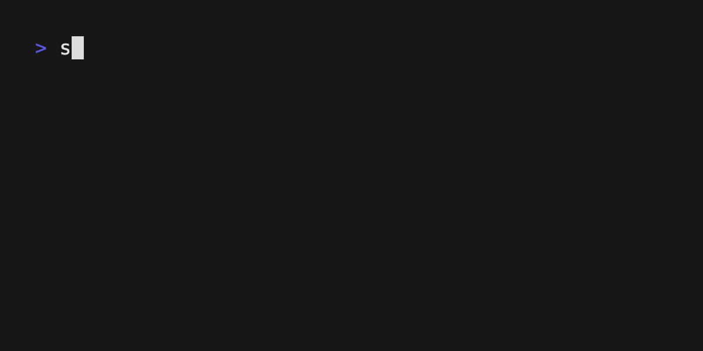

# mossh                                                                   
                                                                     
This is a simple [ssh](https://github.com/charmbracelet/wish) wrapper around [charmbracelet/mods](https://github.com/charmbracelet/mods) designed to allow you to acccess your mods instances from anywhere

### Continuous Chat



### Inline


## Examples
Take a look at the mods examples to see what you can do:

https://github.com/charmbracelet/mods/blob/main/examples.md

Once running and exposed through port 22 you can run like so:

```
ssh mods.your.domain -t -- -f "whats up doc?"
```

or to enter a chat app:
```
ssh mods.your.domain
```

## How To                                         
See `docker-compose.yml` for basic setup. 

#### Tailscale
See `docker-compose-ts.yml` for setup tunneled through tailscale. 

By default it will accept all incoming connections with a valid public key. In order to whitelist only specific public keys, create an allowlist file and set the `MOSSH_ALLOW_LIST` env variable. 

## Pro Tips
You can force requesting the tty to your host with the following config in your sshconfig:

```
Host x.x.x.x
    RequestTTY force
    LogLevel QUIET #removes ssh messages helpful for piping into commands
```

Passing flags directly to mods rather than ssh can be accomplished like so:

```
ssh mods.your.domain -- -C
```

Pass system prompts to mods by configuring them in the `roles` section of your mods settings like so:

```yaml
#mods.yaml
roles:
  "bash":
    - you provide shell commands to resolve common questions
    - the commands don't need any explaining
    - commands should preferably be one-liners
    - do not include any comments
```

For list of flags that can be used with mods [see here](https://github.com/charmbracelet/mods)

## Local Testing
1. Create a `.env` with the values you want from [charmbracelet/mods docs](https://github.com/charmbracelet/mods)
2. `go run .`
3. Open another terminal and run: `ssh localhost -p 23234`


## Repo
The canonical location of the repo is https://git.sr.ht/~zachr/mossh but have added a github remote for the issue tracker, PRs, and community exposure. 

## License                                                             
Released under the MIT License. See the  LICENSE  file for more  
information.